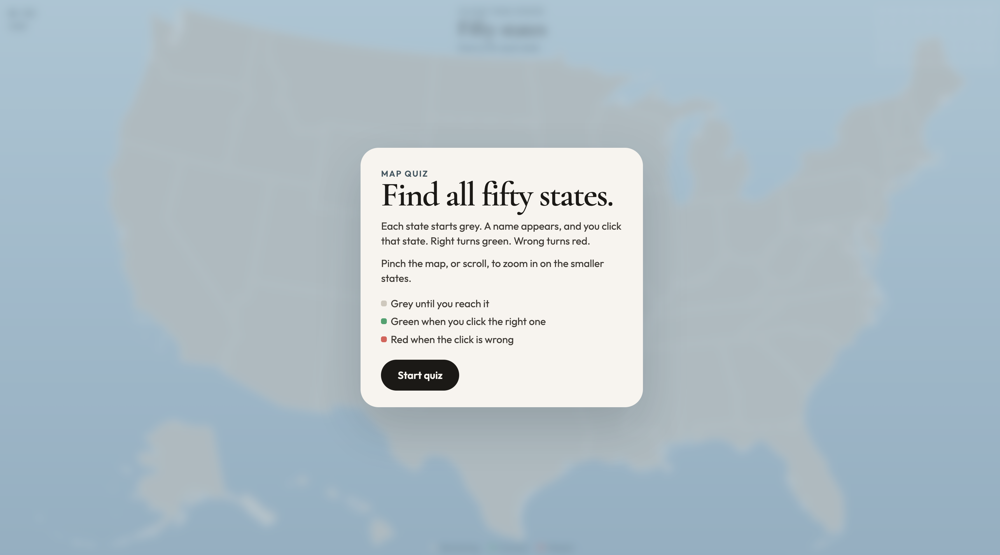
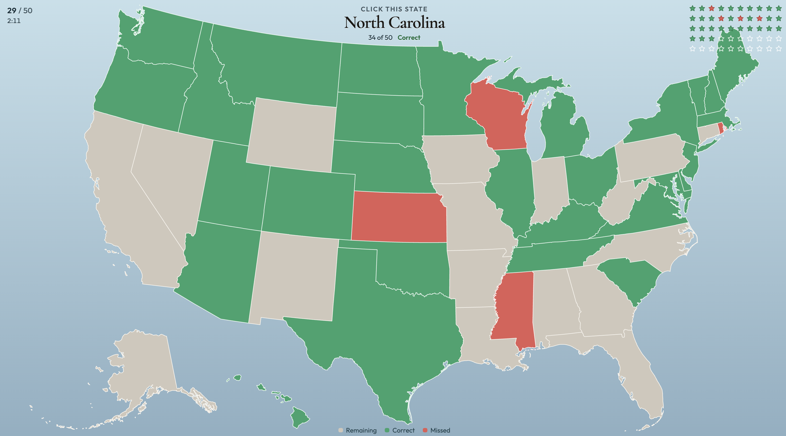

# Fifty

Fifty is a click-the-map quiz for the US states, Western Europe, Eastern Europe, and Africa. Places start grey, turn green when you are right and red when you miss. Pinch or scroll to zoom. Stars track each answer, and a popup shows your score and time.

## Run

From this folder:

```bash
python3 -m http.server 8765
```

Open [http://127.0.0.1:8765](http://127.0.0.1:8765). No install step. You can also open `index.html` directly in a browser.




